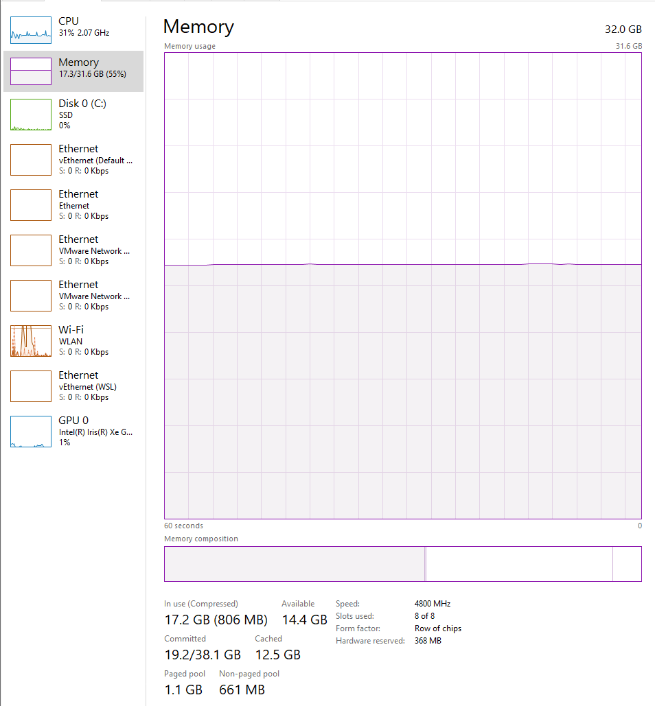
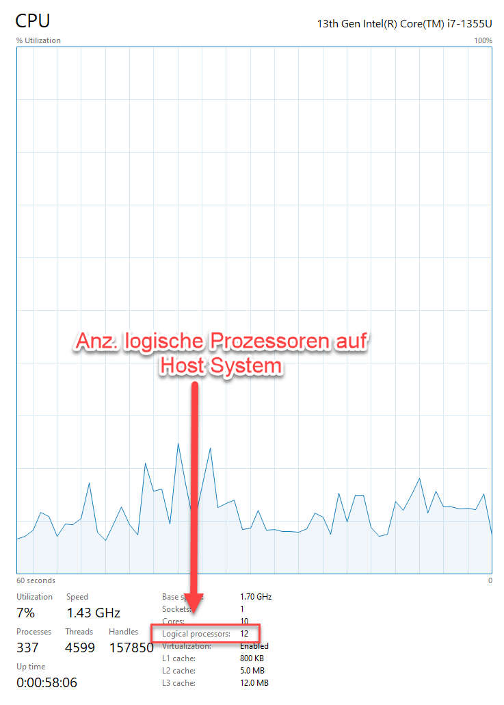
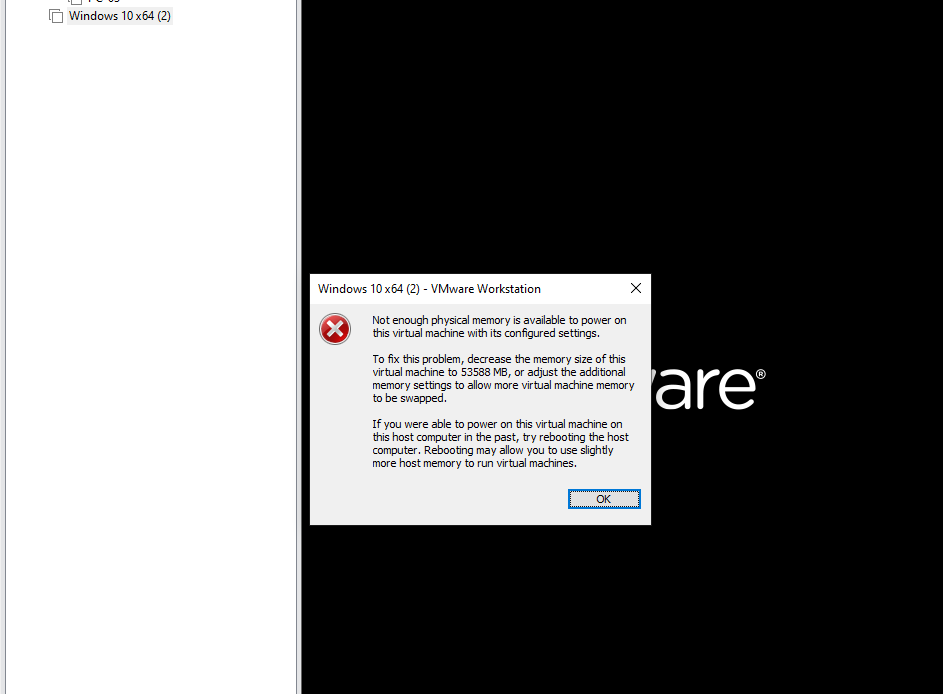
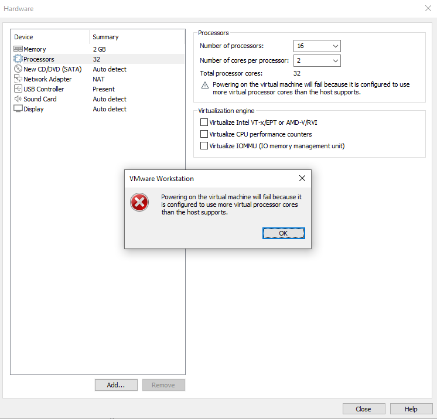

# Task A
Ein **Hypervisor** ermöglicht das Betreiben mehrerer virtueller Maschinen auf einer physischen Hardware.
- **Typ-1-Hypervisor**: Läuft direkt auf der Hardware und bietet bessere Leistung.
- **Typ-2-Hypervisor**: Läuft auf einem Betriebssystem und ist einfacher zu nutzen, aber weniger effizient (z.B. VirtualBox).
  **Unterschied**: Typ-1-Hypervisor läuft direkt auf der Hardware, während Typ-2 auf einem Betriebssystem basiert.

# Task B

## Vermutung: VMware Workstation Pro ist ein Hypervisor Typ 2

Ich vermute, dass **VMware Workstation Pro** ein **Hypervisor Typ 2** ist.

### Begründung für diese Vermutung
**Abhängigkeit vom Host-Betriebssystem**:
VMware Workstation Pro wird auf einem bestehenden Host-Betriebssystem installiert, wie zum Beispiel Windows.
Im Gegensatz zu Typ-1-Hypervisoren, die direkt auf der Hardware laufen, ist VMware Workstation Pro auf das Betriebssystem angewiesen, um Hardware-Ressourcen zu verwalten.

# Hostsystem
## RAM

## CPU

# Vmware Workstation Pro
## Fehlermeldung RAM

## Fehlermeldung CPU

