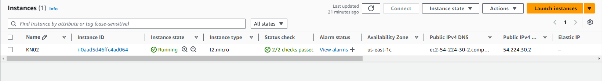

# Screenshot von Instanz

# B) Instanz erstellen
### 1. Diskgrösse

### 2. Betriebssystem

### 3. Grösse des RAM

### 4. Anzahl der CPU-Kerne

### C) Zugriff mit SSH-Key 
1. Key (sandro1)

2. zweiter Key (sandro2)

