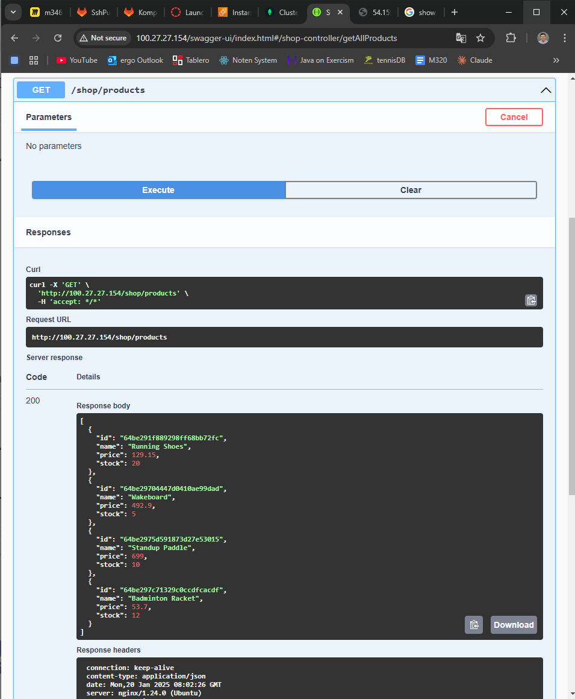
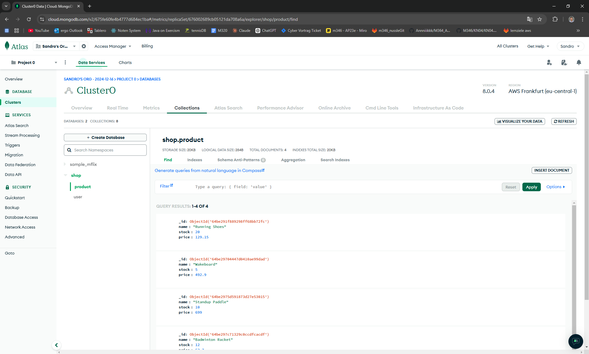
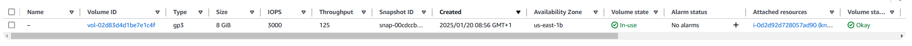
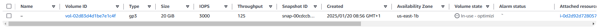
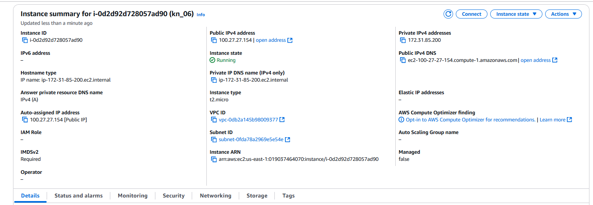
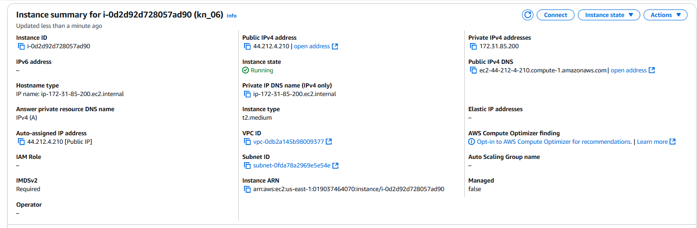
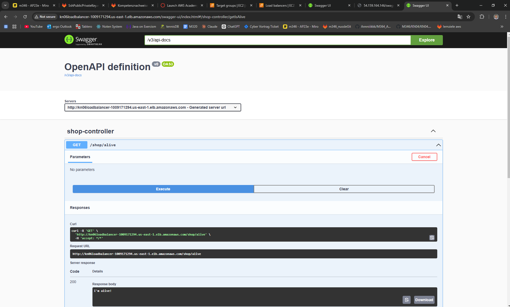
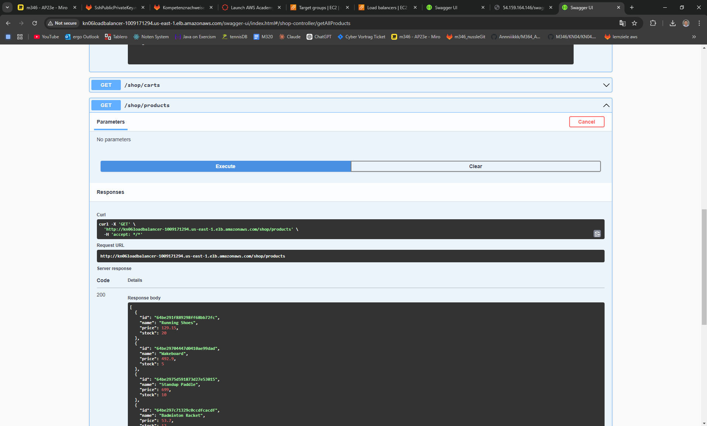
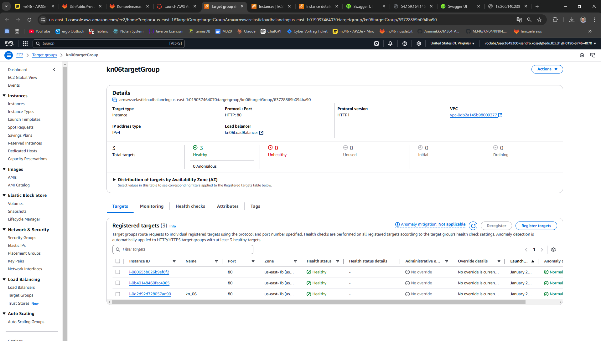

## Aufgabe A Teil b: Web Server installieren auf AWS

TODO: b Instanzen erstellen java and .net 

Kurze Erklärung in eigenen Worten was ein Reverse Proxy ist.
Das ist eine Komponente zwischen dem Server und dem Client. Er schickt die Anfrage vom Client an den Server und sendet dem Server seine Antwort an den Client zurück.

Screenshot der zeigt, dass Sie die Swagger-URL aufrufen können.

Screenshot der zeigt, dass sie den Endpoint products (Java), respGetProducts (.NET) aufrufen können (via Swagger) und auch ein korrektes Resultat bekommen.

Screenshot einer der MongoDB Collections mit Auszug aus dem Inhalt.

Schauen Sie sich das Cloud-Init genau an. Welche(r) Teil(e) macht/machen hier überhaupt keinen Sinn in einer produktiven Umgebung?- Komplette Datenbank wird leergeräumt und die Datenbank wird neu aufgesetzt
- Die DB-Credentials werden direkt im Skript hinterlegt und im Klartext
- sudo: ALL=(ALL) NOPASSWD:ALL erlaubt dem Benutzer ohne Passwort Admin-Rechte

# Aufgabe B)
Vorher

Nachher

Erklärung:
1. Storage im Menü auswählen
2. Volume auswählen
3. Volume Id auswählen
4. auf Modify Button klicken
5. 8GB auf 20GB erhöhen

Geht dies im laufenden Betrieb?
Ja, es geht im laufenden Betrieb.

# Instanztyp ändern

Vorher

Nachher

Erklärung: 
1. Instanz beenden
2. Aktionen/Instance Einstellungen/Instance-Typ ändern
3. Instanz starten

Geht dies im laufenden Betrieb?
Nein, dies geht nicht. Zuerst muss die Instanz gestoppt werden.

# Aufgabe C)
aufgerufene Seiten

DNS
Besitzer der Domain sein
Bei einem DNS provider tbz-m346.ch zu http://kn06-128113009.us-east-1.elb.amazonaws.com mappen

Was ist DNS?
- ist ein riesiges Telefonbuch für das Internet
- mappt URLs auf IP-Adressen

Beispiel
bei einem DNS provider tbz-m346.ch zu http://kn06-128113009.us-east-1.elb.amazonaws.com mappen

# Aufgabe D)

