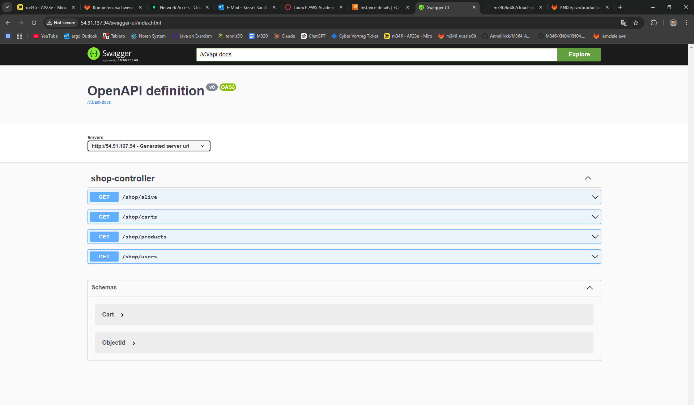
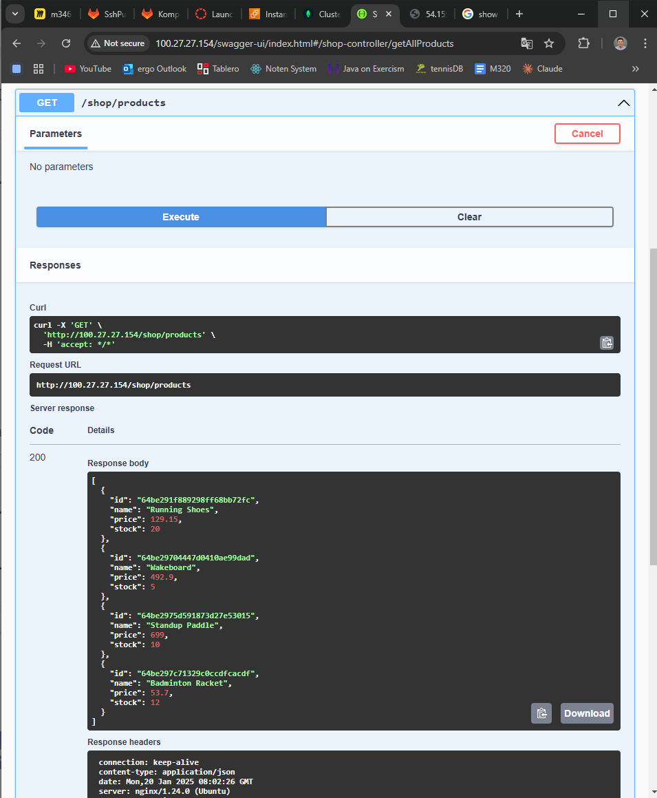
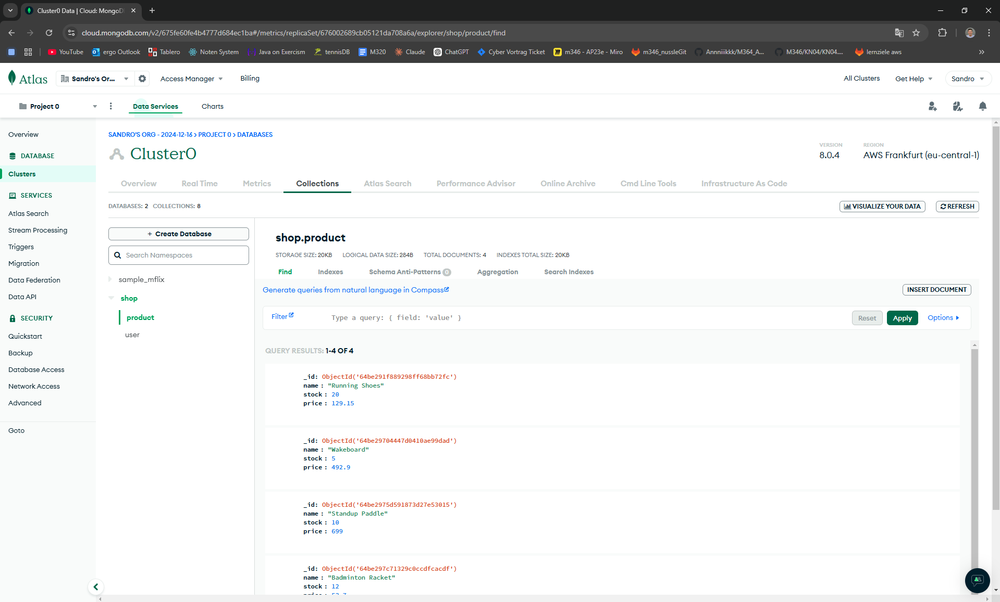
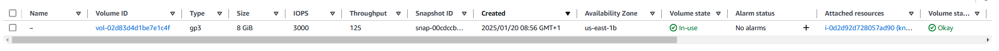
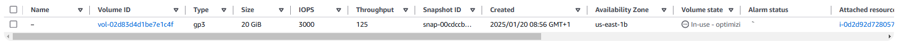
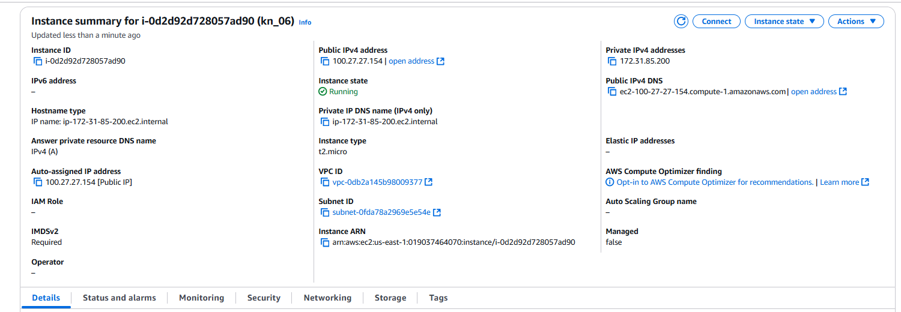
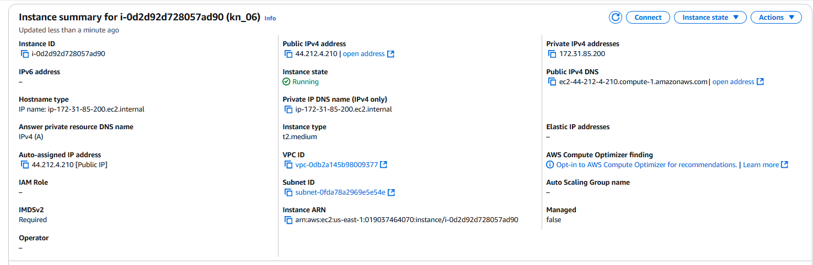
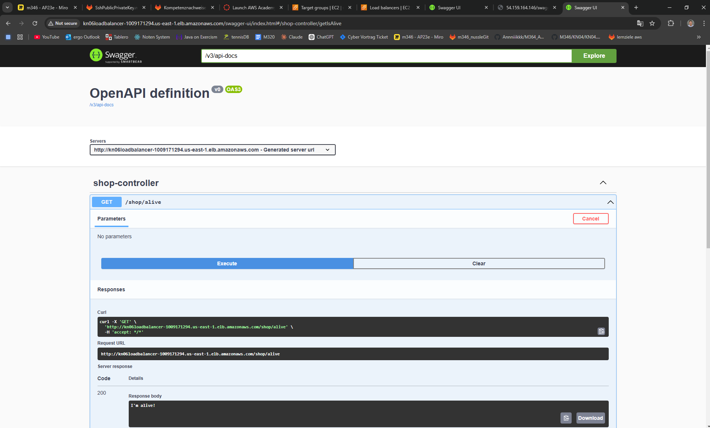
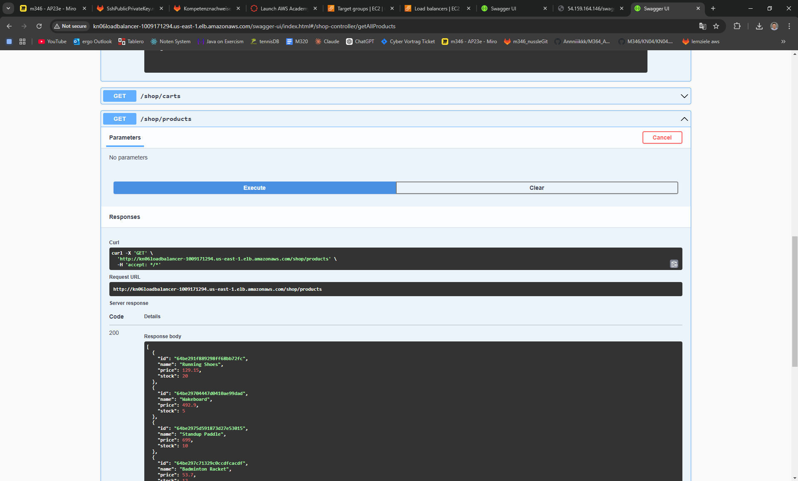
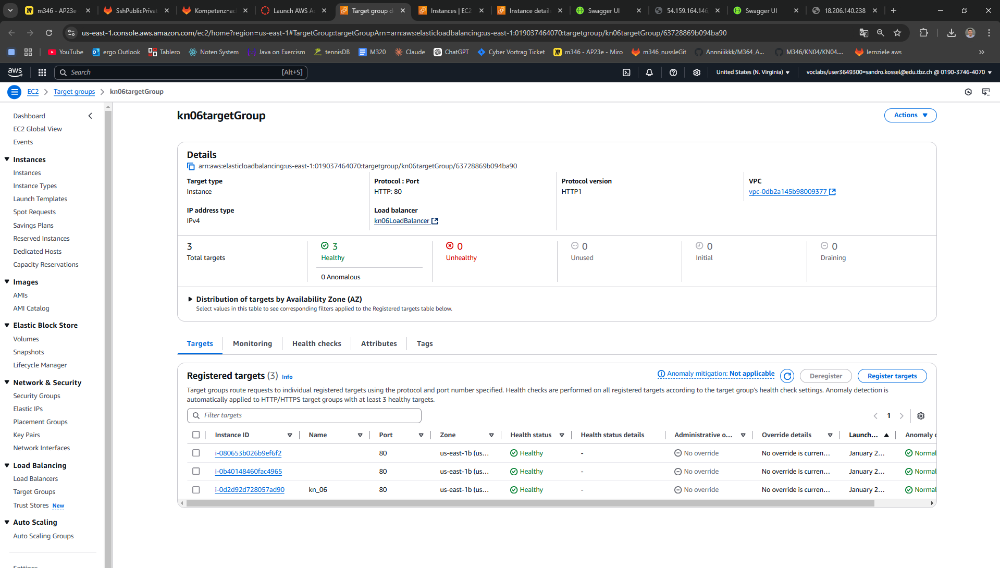

## Aufgabe A Teil b: Web Server installieren auf AWS

Kurze Erklärung in eigenen Worten was ein Reverse Proxy ist.
Das ist eine Komponente zwischen dem Server und dem Client. Er schickt die Anfrage vom Client an den Server und sendet dem Server seine Antwort an den Client zurück.

Screenshot der zeigt, dass Sie die Swagger-URL aufrufen können.

Screenshot der zeigt, dass sie den Endpoint products (Java), respGetProducts (.NET) aufrufen können (via Swagger) und auch ein korrektes Resultat bekommen.

Screenshot einer der MongoDB Collections mit Auszug aus dem Inhalt.

Schauen Sie sich das Cloud-Init genau an. Welche(r) Teil(e) macht/machen hier überhaupt keinen Sinn in einer produktiven Umgebung?- Komplette Datenbank wird leergeräumt und die Datenbank wird neu aufgesetzt
- Die DB-Credentials werden direkt im Skript hinterlegt und im Klartext
- sudo: ALL=(ALL) NOPASSWD:ALL erlaubt dem Benutzer ohne Passwort Admin-Rechte

# Aufgabe B)
Vorher

Nachher

Erklärung:
1. Storage im Menü auswählen
2. Volume auswählen
3. Volume Id auswählen
4. auf Modify Button klicken
5. 8GB auf 20GB erhöhen

Geht dies im laufenden Betrieb?
Ja, es geht im laufenden Betrieb.

# Instanztyp ändern

Vorher

Nachher

Erklärung: 
1. Instanz beenden
2. Aktionen/Instance Einstellungen/Instance-Typ ändern
3. Instanz starten

Geht dies im laufenden Betrieb?
Nein, dies geht nicht. Zuerst muss die Instanz gestoppt werden.

# Aufgabe C)
aufgerufene Seiten

Was ist DNS?
- ist ein riesiges Telefonbuch für das Internet
- mappt URLs auf IP-Adressen

Beispiel
bei einem DNS provider tbz-m346.ch zu http://kn06-128113009.us-east-1.elb.amazonaws.com mappen

# Aufgabe D)

# Leitfragen / Checkpoints
1. Ich kann erklären was ein Reverse Proxy ist und wie er in Zusammenhang steht mit einer Applikation, die auf einem eigenen Port läuft.
- Server, der Anfragen vom Client entgegennimmt und an den Server weiterleitet
- Reverse Proxy läuft bspw. auf Port 80 und leitet Anfragen an den Webserver auf Port 8080 weiter (Sicherheitsgründe, Load-Balancing)
2. Ich kann einen Service auf Ubuntu aktivieren, starten, stoppen, etc. Ich weiss ausserdem wie ich eine Java oder .NET Applikation starten kann und welche Tools dazu notwendig sind.
- wenn Instanz gestoppt wird, dann probiert der Server die Java-Applikation zu erreich, findet sie jedoch nicht, da Instanz gestoppt ist
3. Ich kenne den Zusammenhang zwischen der Applikation und der Konfigurationsdatei.
- die Konfigurationsdatei enthält die Einstellungen für die Applikation
4. Ich kann eine Datenbank mit MongoDB Atlas einrichten und die Sicherheitsregel so festlegen, dass die Datenbank geschützt ist.
   0.0.0.0/0: Zugriff von jeder IP-Adresse möglich
5. Ich kann vertikale und horizontale Skalierung erklären und mit Beispielen ausführen. Ausserdem kann ich mit den AWS Services und Tools die beiden Skalierungsarten umsetzen.
vertikal: eine Instanz von 5GB auf 20GB erhöhen
horizontal: Auto-Scaling-Group erstellen
6. Ich kann Cloud-Init mit Hilfe einer Vorlage auch für kompliziertere Umgebung verwenden.
siehe Cloud init

health checks
- EC2-Health-Checks (überpruefen, ob deine Instanz läuft und das Betriebssystem gesund ist)
- ELB-Health-Checks (überpruefen, ob deine Anwendung auf der Instanz korrekt antwortet)

Links:
- AWS: https://us-east-1.console.aws.amazon.com/ec2/home?region=us-east-1#InstanceDetails:instanceId=i-03a8c4b14f0bf9269
- Git Lab: https://gitlab.com/ch-tbz-it/Stud/m346/m346/-/blob/main/Kompetenznachweise/KN06.md
- MongoDB: https://cloud.mongodb.com/v2/675fe60fe4b4777d684ec1ba#/security/network/accessList
